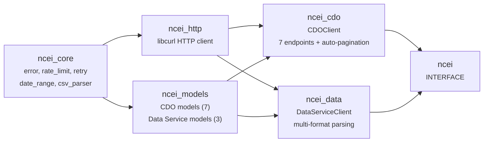
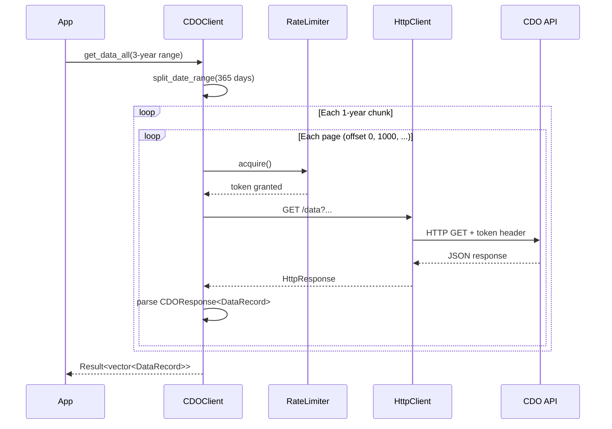

# ncei-cpp

[](https://github.com/Reddimus/ncei-cpp/actions/workflows/ci.yml)
[](https://github.com/Reddimus/ncei-cpp/releases)
[](https://en.cppreference.com/w/cpp/23)
[](https://opensource.org/licenses/MIT)

C++23 SDK for the [NCEI](https://www.ncei.noaa.gov/) (National Centers for Environmental Information) climate data APIs.

Access decades of historical weather data — temperature, precipitation, wind, pressure, and more — from 100+ global datasets. Supports both the CDO Web Services v2 API and the newer Access Data Service API.

## Quick Start

### CDO API (requires free API token)

```cpp
#include "ncei/ncei.hpp"
#include <iostream>

int main() {
    ncei::CDOClient::Config config;
    config.token = "YOUR_CDO_TOKEN";  // from ncdc.noaa.gov/cdo-web/token
    ncei::CDOClient client(std::move(config));

    ncei::GetDataParams params;
    params.dataset_id = "GHCND";
    params.start_date = "2024-01-01";
    params.end_date = "2024-01-07";
    params.station_id = "GHCND:USW00013874";
    params.data_type_ids = {{"TMAX", "TMIN"}};

    ncei::Result<std::vector<ncei::DataRecord>> data = client.get_data_all(params);
    if (!data) {
        std::cerr << data.error().message << "\n";
        return 1;
    }

    for (const auto& record : *data) {
        std::cout << record.date << " " << record.datatype
                  << " = " << record.value << "\n";
    }
}
```

### Access Data Service (no auth required)

```cpp
#include "ncei/ncei.hpp"
#include <iostream>

int main() {
    ncei::DataServiceClient::Config config;
    ncei::DataServiceClient client(std::move(config));

    ncei::DataRequestParams params;
    params.dataset = "daily-summaries";
    params.stations = {{"USW00013874"}};
    params.start_date = "2024-01-01";
    params.end_date = "2024-12-31";
    params.data_types = {{"TMAX", "TMIN", "PRCP"}};
    params.format = ncei::ResponseFormat::JSON;

    ncei::Result<ncei::DataPointCollection> data = client.get_data(params);
    if (!data) {
        std::cerr << data.error().message << "\n";
        return 1;
    }

    for (const auto& point : data->records) {
        std::optional<double> tmax = point.get_double("TMAX");
        if (tmax) {
            std::cout << point.date << " TMAX=" << *tmax << "\n";
        }
    }
}
```

## Features

- **Two API clients**: CDOClient (legacy, token auth) + DataServiceClient (newer, no auth)
- **C++23** with `std::expected<T, Error>` — no exceptions
- **Auto-pagination**: CDOClient fetches all pages transparently
- **Auto-date-splitting**: Multi-year queries automatically split into 1-year chunks (CDO API limit)
- **Multi-format parsing**: CSV, JSON, SSV parsed into typed `DataPointCollection`
- **Rate limiting**: Token bucket (5 req/sec) + daily counter (10K/day) for CDO API
- **Retry with backoff**: Configurable exponential backoff with jitter
- **Null-safe JSON**: Custom helpers prevent crashes on null API values
- **166 unit tests** with fixture data

## Building

### Requirements

- C++23 compiler (GCC 13+, Clang 16+)
- CMake 3.20+
- libcurl

### Build

```bash
make build        # Release build
make test         # Run tests
make lint         # Check formatting
make format       # Format code
make coverage     # Code coverage report (requires lcov)
```

### CMake Options

| Option | Default | Description |
|--------|---------|-------------|
| `NCEI_BUILD_TESTS` | `ON` | Build unit tests |
| `NCEI_BUILD_EXAMPLES` | `ON` | Build examples |
| `NCEI_ENABLE_LTO` | `ON` | Link-time optimization |
| `NCEI_ENABLE_NETCDF` | `OFF` | NetCDF format support (requires libnetcdf) |
| `NCEI_ENABLE_SANITIZERS` | `OFF` | ASan + UBSan |

### Using as a Dependency

```cmake
include(FetchContent)
FetchContent_Declare(ncei-cpp
    GIT_REPOSITORY https://github.com/Reddimus/ncei-cpp.git
    GIT_TAG v0.1.0
)
FetchContent_MakeAvailable(ncei-cpp)
target_link_libraries(myapp PRIVATE ncei)
```

Or after installation:

```cmake
find_package(ncei CONFIG REQUIRED)
target_link_libraries(myapp PRIVATE ncei::ncei)
```

## Architecture



### Data Flow



## API Coverage

### CDO Web Services v2 (token required)

| Endpoint | Methods |
|----------|---------|
| Datasets | `get_datasets()`, `get_dataset(id)` |
| Data Categories | `get_data_categories()`, `get_data_category(id)` |
| Data Types | `get_data_types()`, `get_data_type(id)` |
| Location Categories | `get_location_categories()`, `get_location_category(id)` |
| Locations | `get_locations()`, `get_location(id)` |
| Stations | `get_stations()`, `get_station(id)` |
| Data | `get_data(params)`, `get_data_all(params)` |

### Access Data Service (no auth)

| Endpoint | Methods |
|----------|---------|
| Data (data/v1) | `get_data(params)`, `get_data_raw(params)` |
| Metadata (support/v3) | `get_dataset_metadata(id)` |

### Available Datasets

GHCND (daily), GSOM (monthly), GSOY (yearly), daily-summaries, global-hourly, global-summary-of-the-month, local-climatological-data, normals-daily, normals-monthly, and 90+ more.

## Examples

```bash
export NCEI_CDO_TOKEN="your_token_here"
make run-basic_cdo_usage        # List datasets
make run-historical_temperature # Daily temps for a station
make run-multi_year_data        # Auto-splitting demo
make run-format_comparison      # CSV vs JSON (no auth)
make run-data_service_search    # Dataset metadata (no auth)
```

## Dependencies

| Library | Purpose | Integration |
|---------|---------|-------------|
| libcurl | HTTP requests | `find_package(CURL)` |
| nlohmann/json | JSON parsing | `FetchContent` |
| GoogleTest | Unit testing | `FetchContent` |
| libnetcdf | NetCDF support (optional) | `find_package(netCDF)` |

## References

- [CDO Web Services v2 Documentation](https://www.ncdc.noaa.gov/cdo-web/webservices/v2)
- [NCEI Access Data Service API Documentation](https://www.ncei.noaa.gov/support/access-data-service-api-user-documentation)
- [NCEI Data Access Portal](https://www.ncei.noaa.gov/access)
- [CDO API Token Registration](https://www.ncdc.noaa.gov/cdo-web/token)
- [NCEI API Guide (Community)](https://github.com/partytax/ncei-api-guide)
- [Available CDO Datasets](https://www.ncei.noaa.gov/cdo-web/datasets)

## Contributing

Issues and pull requests are welcome. For non-trivial changes please
open an issue first to discuss the approach. Local dev loop:

```bash
make build           # cmake -B build && cmake --build build
make test            # ctest --output-on-failure
make lint            # clang-format --dry-run -Werror
make format          # clang-format -i (call before pushing)
```

CI runs the same lint+build+test on push and PR (Ubuntu 24.04 +
macos-latest); see `.github/workflows/ci.yml`.

## License

MIT
